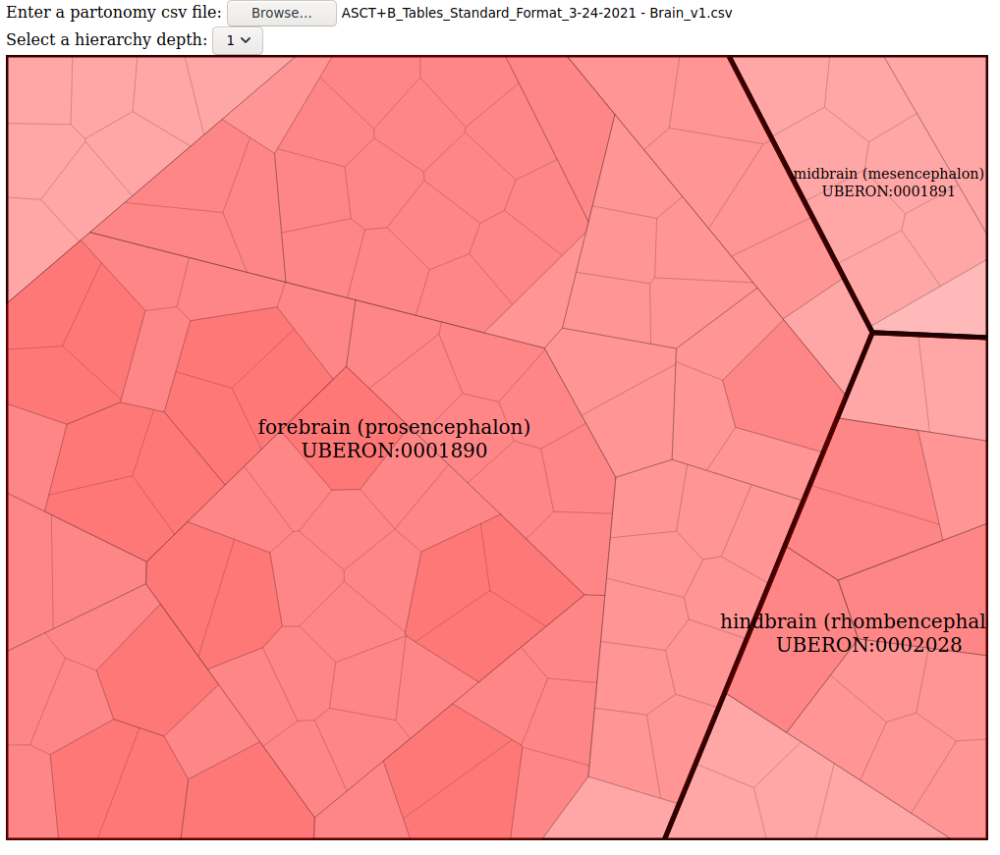
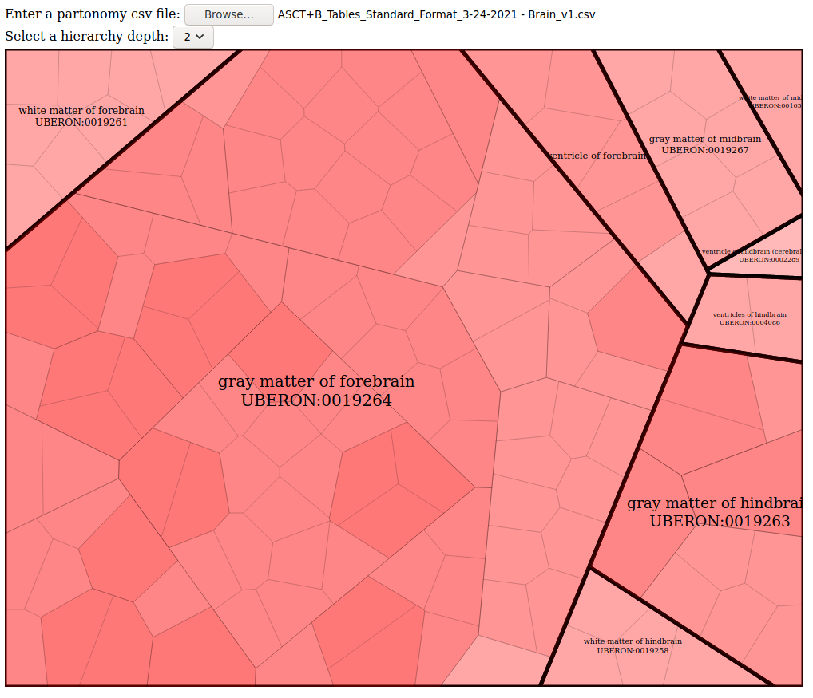
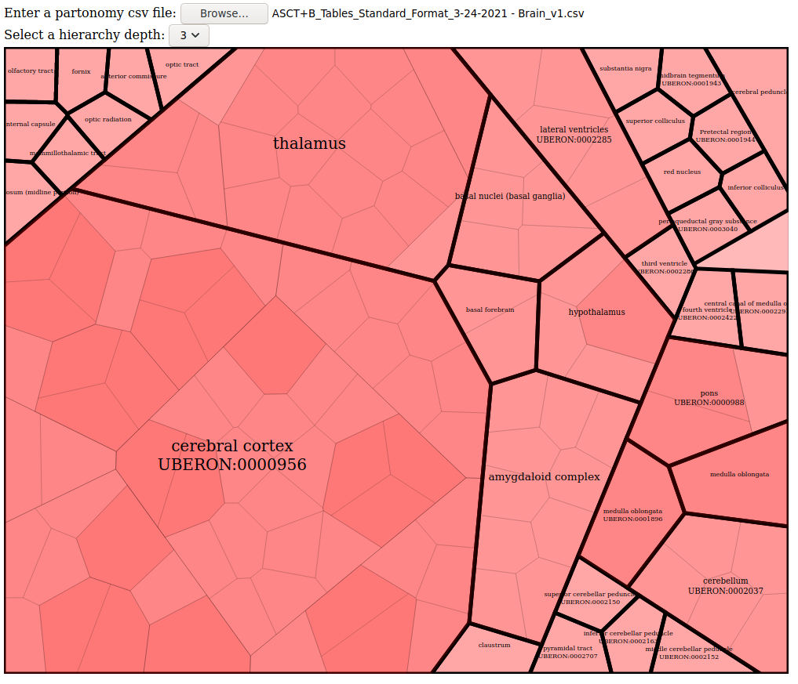
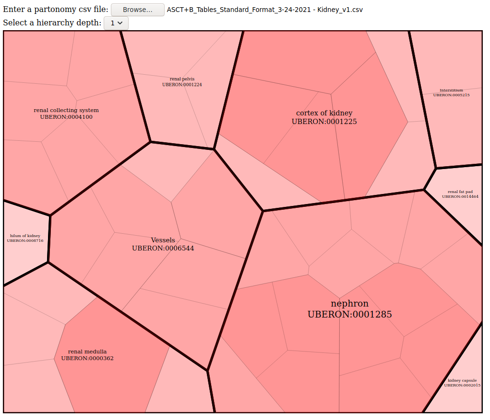
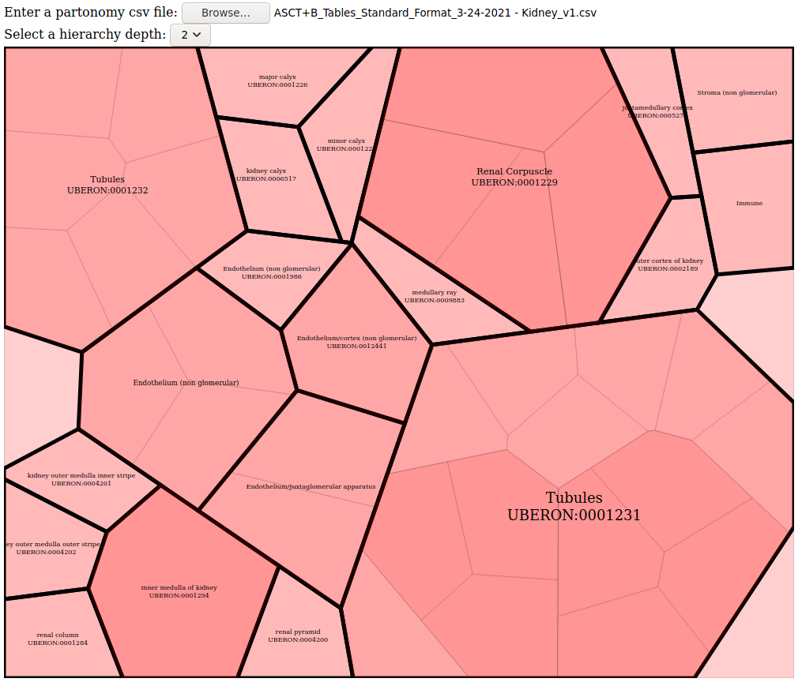
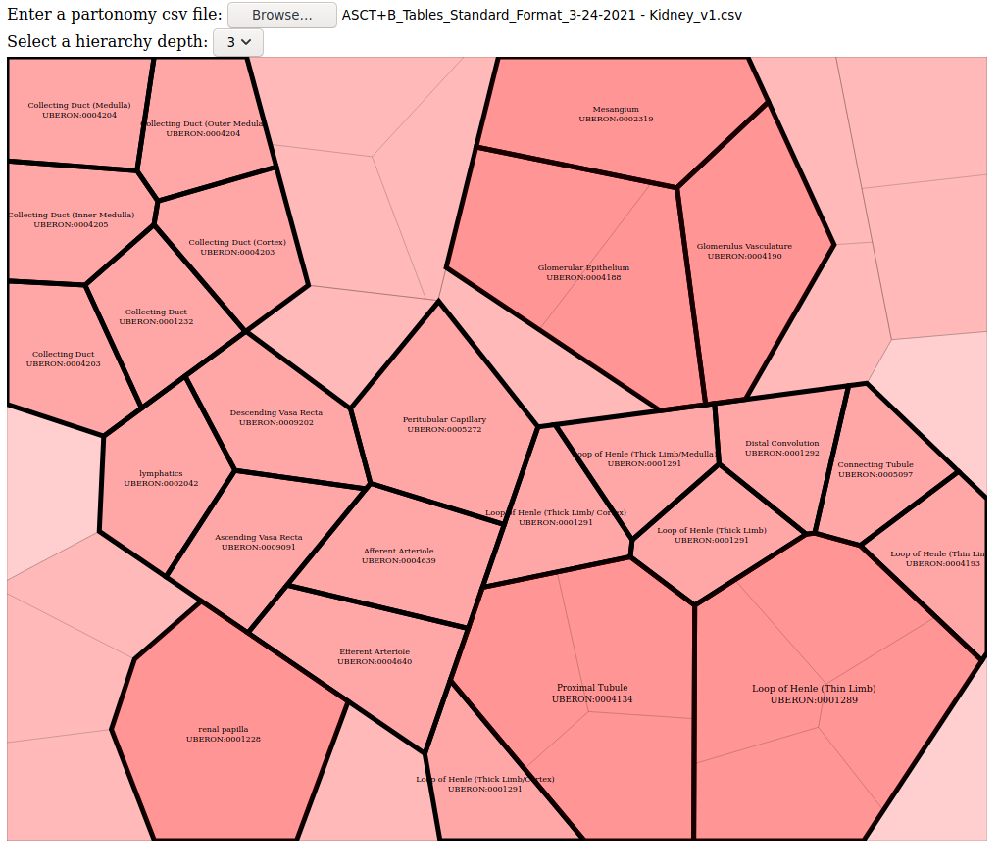

# Human Body Partonomy

## Installation
No special instructions. Just clone this repo and open ```index.html``` in any
browser. (tested with Firefox)

## Usage instructions
The UI is fairly simple. The file input is used to select csv versions of
 partonomy sheets from the master table at https://hubmapconsortium.github.io/ccf-asct-reporter/.
 Example csv files can be found in ```data``` directory.
 
Selecting a number from the drop-down input will highlight and label anatomical
 structures at that depth number in the hierarchy of the partonomy.

## Overview
The project is mostly implemented in vanilla JavaScript using the d3 voronoi
 plugin mentioned in the task description. Another library called ```Papa``` was
 used for csv parsing. This project should most likely work with any other
  body-part's partonomy data similar to kidneys data (currently it has been
tested to work with brain partonomy data). Only anatomical structure column data
 (AS/*) has been used for visualization since the bio markers and cell type data
    seems to not follow a tree structure. The weight of the polygon is the
     number of children that it has. This visualization tool can view the
      partonomy at different depths of the hierarchy with the help of a 
drop-down menu in the UI. 


## Anomalies in the data
- Some nodes didn't have label or id; only name.
- There are two Endothelium (non glomerular) -- one with an ID and another 
without. The one with the ID is not included in the ASCT+B reporter 
visualization tool.

## Visualization Screenshots

- These are screenshots for the visualizations for the brain partonomy data at
 depths 1, 2 and 3 respectively.
 
 
 
- These are screenshots for the visualizations for the kidney partonomy data at
 depths 1, 2 and 3 respectively.
 
 
 
